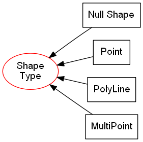
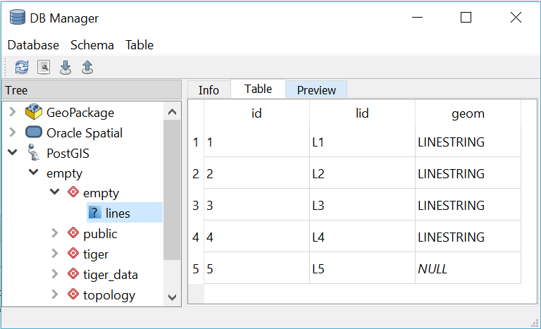

.. _concept-page:

**********
Background
**********

The concepts of relational datasets in general, and, of geospatial data values and data types are introduced.  An emphasis is placed on *empty* and *null* geospatial data values.  QGIS software is also introduced.  Specific QGIS problems that are associated with geospatial data values and data types are kept within the :ref:`QGIS Data Provider Data Parsing Problems` section.

===================
Relational Datasets
===================

A *set* is a collection of distinct objects.  For example, a box of apples is a *set* of apples, and, the *set* of countries in North America contains: Canada;  United States of America; and, Mexico.  By convention, sets are symbolized by enclosing within curly brackets.  Hence:

.. math::

   North\ American\ Countries = \{Canada, United\ States\ of\ America, Mexico\}

A dataset is any set where each element is restricted to one data type *and* where each element belongs to the same universal set.

A relational dataset is a collection of sets where:

  1. The number of objects (elements) in each set is the same; and,
  2. A one to one relationship exists between elements of different sets.

An example relational dataset showing the Country Name, Country Abbreviation and Country Population for the countries in North America is shown in :numref:`tableNA_Simple`.  This relational dataset comprises of the three sets: country names; country name abbreviations; and, country populations.  A one to one relationship exists between the elements for each of these three sets.  Hence, the country with the name of *Canada* has a one to one relationship with the country abbreviation *CAN* and the country population *3563000*.  The combination of the relationship and the set values for a specific country is represented as a row in a table that is referred to as a *record*.

.. _tableNA_Simple:

.. table:: Example of a North America Countries dataset.
   :widths: auto
   :align: center

   +--------------------------+--------------------------+--------------+
   | |  Country Name          | | Abbreviation           | | Population |
   | | (letters and spaces)   | | (3 upper case letters) | | (integer)  |
   +==========================+==========================+==============+
   | Canada                   | CAN                      |  3563000     |
   +--------------------------+--------------------------+--------------+
   | United States of America | USA                      |  32663000    |
   +--------------------------+--------------------------+--------------+
   | Mexico                   | MEX                      |  12458000    |
   +--------------------------+--------------------------+--------------+

Essential to any set is a definition or description of what type of objects can be a member.  For example, an apple which is a valid type of the set of fruit can't be a member of a set of countries.  For any dataset, both the data type and additional constraints are often used together to define the universal set.  For example, the data type for *Country Name* in :numref:`tableNA_Simple` is any combination of letters and spaces, whilst the data type for *Abbreviation* is any combination of 3 upper case letters.

Although a *relational dataset* consists of *multiple sets* of data where the elements of each set are related, it is ubiquitously referred to as a **dataset**.

------------------
Geospatial Dataset
------------------

A geospatial dataset refers to any dataset where one or more of the composite sets refer to a location on the earth's surface.  This project scope is restricted to those geospatial datasets where the location on the earth's surface is represented by one or more points, lines or polygons that are located by vertices (coordinates) and stored as vectors.  These points, lines and polygons are collectively referred to as shapes or *geometries* [#f5]_.  Datasets that include one or more sets of geospatial vectors are referred to as *Vector Datasets* by the GIS community.  A vector geospatial dataset is a subtype of geospatial dataset where the geospatial sets can be located graphically on the earths surface by the application of coordinates.

===================
Geometry Data Types
===================

All datasets contain some restriction on the type of data each constituent set may contain.  From a software perspective, a restriction of type is essential for minimizing both the storage size of the dataset and the response time for a dataset query.  Analagous to specific data types for storage of numbers, text or dates there are data types specifically used for the storage of geospatial geometries :cite:`ISO19125-2`.  Similarly, just as there can be specific data types for numbers including signed and unsigned integers, float, and, decimal numbers, there are also specific data types for different types of geometries, with the type often referring to how the geometry is constructed.

For any data source the geometry data types that are availabe for use can be shown schematically as a hierarchy like the one shown in :numref:`figureGeomTypeI`.  Within this hierarchy, the possible data types are described by the labels in the boxes.  Essential to all such hierarchy's, a set of data of a declared type may consist of any type below it on the hierarchy.  Hence for the hierarchy shown, if a set of data has a declared type of *Geometry Collection* then any data element within it may consist of *Geometry Collection*, *Multi-Point*, *Multi-Curve*, *Multi-Line*, *Multi-Surface*, and, *Multi-Polygon*.  Similarly, if a set of data has a declared type of *Point* than it may not contain a *Polygon* nor a *Line* as neither are below the sub-type *Point* on the hierarchy.

The single part constrained geometry subtypes in the lower part of :numref:`figureGeomTypeI` are referred to as *Primitive Types* and must contain only one single part geometry per set element.  In contrast, the *Multiple Parts* geometries may consist of one *or* many parts per feature.  For example, a feature of the *"Multi-Point"* geometry sub type may have one point, no points or multiple points. Another characteristic of the single part primitive types is that the *Line* and *Polygon* subtypes may only exist of straight line segments between coordinates.

.. _figureGeomTypeI:

   GIS Geometry subtype hierarchy.  Adapted from :cite:`ISO19125-2`.  The more conventional term *"LineString"* that is used in the QGIS API and :cite:`ISO19125-2` is replaced here with *"Line"* for clarity.

In reality there may be many more geometry subtypes than the simplified hierarchy shown in :numref:`figureGeomTypeI`.  For example, some common additional subtypes for datasets are created for sets of geometries that incorporate elevation, or, for lines that are constructed from curves as opposed to straight line segments.  In another variation, some geometry hierarchy's including Microsoft SQL server and QGIS don't isolate primitive geometry sub-types from non-primitive sub-types.

Many GIS data source standards, and, many GIS software have a geometry subtype hierarchy that is **similar** with :numref:`figureGeomTypeI`, including the `inheritance diagram for QGIS's QgsAbstractGeometry <https://qgis.org/api/classQgsAbstractGeometry.html>`_ :cite:`QGSAbstractGeometry`.

====================
Geometry Data Values
====================

For any data type there exists a universal set of valid values.  For example, a set of birthday dates must be restricted to valid dates.  Hence, a birthday on the 30th of February is not valid as the 30th of February is not part of the universal set of dates.  Similarly, a valid geometry should be located within the boundaries of the coordinate system that it is referenced to.  **Empty** and **null** are two values that may be part of many sets of data and for geometry data values could be fairly described as being:

1. controversial;
2. miss-understood; and,
3. best avoided.

.. _EmptyAnchor:

-----
Empty
-----

A box of apples can be described as a set of apples.  An *empty* Apple box represents an *empty* set of apples.  An *empty* geometry element is a geometry that has no coordinates.  Whether an *empty* element is a valid member of a set depends on the context.  For example, if a study of chickens hatching from eggs recorded the date that each chicken hatches for a set of 10 eggs, than the hatch date element for each egg is *empty* before the chicken hatches.  It is *known* that the chicken has not hatched.

All *empty* set values including an *empty* geometry data value are place holders for when it is *known* that an element does not exist :cite:`OGC2010`.  For example, consider the intersection :cite:`IntersectDefinition` of the *Blue Crosses* and the *Red Circles* with the two squares shown in :numref:`figureSquarePoint`.  Both of the *Blue Crosses B1* and *B2* intersect the *Left square*, and, the *Blue Cross B3* intersects the *Right square*.  The intersections of the *Squares* and *Blue Crosses*, and the *Squares* with *Red Circles* are summarized by the datasets shown in :numref:`tableIIIA` and :numref:`tableIIIB`.  As shown in  :numref:`tableIIIA` the *Left Square* intersects with the *Blue Crosses* *B1* and *B2* as represented by the subset *{B1, B2}*.  Similarly, it is reported in :numref:`tableIIIB` that the *Left square* intersects the subset of *Red Circles* *{R1}*.  In contrast, also in :numref:`tableIIIB` it is shown that the *Left square* does not intersect with any *Red Circles* as shown by the *empty* set *{ }*.  Here the *empty* set *{ }* shows that it is known that no intersection occurs.  The reporting of those combinations where intersections are known to not occur as shown in :numref:`tableIIIB` follows the convention used by most SQL type relational databases for all set intersections regardless of whether they are geospatial or not.  In contrast, the convention for many GIS desktop software including QGIS and ArcGIS is to only show those combinations where intersections are known to occur (are *True*).  :numref:`tableIIIC` follows the geospatial intersection convention of QGIS and shows only those combinations in :numref:`tableIIIB` that do intersect.  Analyzing those sets that don't intersect (*empty* sets) can be insightful for data workflow problem solving .

.. _figureSquarePoint:

.. figure:: _static/squaresAndPoints.png
   :scale: 50%
   :align: center

   The location of *Blue Crosses* and *Red Circles* in the “Left Square” and the “Right Square”.

.. _tableIIIA:

.. table:: The intersection of the *Squares* and the *Blue Crosses*.
   :widths: auto
   :align: center

   +--------------+--------------+
   | Square       | Blue Crosses |
   +==============+==============+
   | Left square  | {B1, B2}     |
   +--------------+--------------+
   | Right square | {B3}         |
   +--------------+--------------+

.. _tableIIIB:

.. table:: The intersection of the *Squares* and the *Red Circles*.
   :widths: auto
   :align: center

   +--------------+--------------+
   | Square       | Red Circles  |
   +==============+==============+
   | Left square  | {R1}         |
   +--------------+--------------+
   | Right square | {  }         |
   +--------------+--------------+

.. _tableIIIC:

.. table:: The intersection of the *Squares* and the *Red Circles* where the intersection is *True*.
   :widths: auto
   :align: center

   +--------------+--------------+
   | Square       | Red Circles  |
   +==============+==============+
   | Left square  | {R1}         |
   +--------------+--------------+

The real utility of *empty* geometry values is realised when the intersection of all the squares and both types of points (*Red Circles* and *Blue Crosses*) are collated in one dataset as shown in :numref:`tableIII` as opposed to :numref:`tableIIID`.  By using the *empty* set *{ }* as a place holder for the known non-intersection of *Red Circles* with the *Right square* the sets of *Blue Crosses* and *Red Circles* are maintained as separate columns in :numref:`tableIII`.  Although this approach is efficient and intuitive it is not suitable when there are a large number of point types as the number of columns has a linear relationship to the number of point types.

.. _tableIII:

.. table:: The intersection of each point type set and the set of squares.  Note that the point type sets are maintained as separate sets (columns).
   :widths: auto
   :align: center

   +--------------+----------------------------+
   | Square       | Point type                 |
   +              +--------------+-------------+
   |              | Blue Crosses | Red Circles |
   +==============+==============+=============+
   | Left square  | {B1, B2}     | {R1}        |
   +--------------+--------------+-------------+
   | Right square | {B3}         | { }         |
   +--------------+--------------+-------------+

.. _tableIIID:

.. table:: The intersection of all point types and the squares with one combined set of point types, and, where the intersection is *True*.
   :widths: auto
   :align: center

   +--------------+--------------+----------+
   | Square       | Point type   | Geometry |
   +==============+==============+==========+
   | Left square  | Blue Crosses | {B1, B2} |
   +--------------+--------------+----------+
   | Right square | Blue Crosses | {B3}     |
   +--------------+--------------+----------+
   | Left square  | Red Circles  | {R1}     |
   +--------------+--------------+----------+

^^^^^^^^^^^^^^^^^^^^^^^^^^^^^^^^^^^^
Datasets With Multiple Geometry Sets
^^^^^^^^^^^^^^^^^^^^^^^^^^^^^^^^^^^^

Much of the GIS community work with the restriction of a single geometry set per dataset (a single geometry column within a table).  It is difficult to have multiple geometry attributes without also allowing *empty* geometry values.  Next, I will examine the advantages and disadvantages of multiple geometry attributes.

The fundamental advantage of multiple geometry attributes is they facilitate topology. Topology refers to how the constituent parts of a system are interrelated or arranged.  The location of points within squares shown schematically in :numref:`figureSquarePoint` is an example of topology as it shows how the points are related to the squares.  :numref:`tableIII` shows the topological association of point type by square type, but, uses two geometry columns to do so.  :numref:`tableIIID` shows all of the True intersections shown in :numref:`tableIII` using only one geometry column.  Examination of :numref:`tableIIID` reveals that the relationship between a type of point (e.g. Blue Crosses) and the Square type (e.g. Left Square or Right Square) has to be reported as two separate relationships (two separate records) and a user is left with the task of mentally associating these two relationships.  Clearly, without using multiple geometry columns establishing topological relationships is less intuitive.

A major disadvantage of multiple geometry columns is that they are not supported by many GIS software or GIS data sources.  For example, ArcGIS does not support multiple geometry columns in any capacity, QGIS treats each geometry column as an unrelated dataset, and, the ubiquitous shapefile can only contain one geometry column.  So, by adopting multiple geometry columns a user potentially isolates themself from a significant portion of the GIS community.

^^^^^^^^^^^^^^^^^^^^^^^^^^^^^^^^^^^^^^^^^^^^^^^^^^^^^^^^^^^^^^^^^^^^^^^^
Set Operations in Microsoft SQL or PostGIS Produce Empty Geometry Values
^^^^^^^^^^^^^^^^^^^^^^^^^^^^^^^^^^^^^^^^^^^^^^^^^^^^^^^^^^^^^^^^^^^^^^^^

There are several fundamental set operations that are used to construct new sets from existing sets regardless to what it is a set of :cite:`SetTheoryOverall`.  Within a database, it is ideal if a set operation is consistent for all data types, regardless of whether they are geospatial or not.  As introduced in the section :ref:`Empty` some databases generate *empty* geometry values for intersection set operations.  Other universal set operations include Union and Except.  Microsoft SQL Server and PostGis are examples of databases that can generate *empty* geometry values for set operations.  Both of these databases were developed from SQL conventions and their generation of *empty* values for geometries is consistent with set operations for other data types.

Consider the intersection of the points *Pt1* and *Pt2* with the circle shown in :numref:`figureVI` which is an example of an intersection between two geometry datasets.  ‘Pt1’ lies within the *circle*, and, hence intersects the *circle*.  *Pt2* lies outside the *circle* and does not intersect it.  In both QGIS v3.x and ArcGIS desktop, the intersection of a points dataset containing *{Pt1, Pt2}* and a dataset containing the *circle* will return only those records that intersect, hence, only *Pt1* is returned.  In contrast, with Microsoft SQL Server, the intersection returns both the records that do and don’t intersect with a dataset containing both *Pt1* and *Pt2*.

.. _figureVI:

.. figure:: _static/FigureV.png
   :scale: 50%
   :align: center

   A schematic of the intersection of points *Pt1* and *Pt2* with the *circle*.

There is no error with either of the different approaches to intersection taken by QGIS 3.x and Microsoft SQL Server.  QGIS 3.x includes the selection logic step that removes those records that don’t intersect.  For *Pt2*, Microsoft SQL server is returning an *empty* geometry confirming that no intersection exists, as shown by the following Transact-SQL script [#f2]_::

   DECLARE @circle geometry = 'CURVEPOLYGON (CIRCULARSTRING (0 1, 1 2, 2 1, 1 0, 0 1))';
   DECLARE @Pt2 geometry = 'POINT (3 1)';
   SELECT @Pt2.STIntersection(@circle).ToString();
   GEOMETRYCOLLECTION EMPTY

This intersection example shows the ease with which one can inadvertently generate *empty* geometry values in Microsoft SQL Server, and, these *empty* geometry values will be parsed to QGIS.

----
null
----

**null** is the most common value (element) recorded by many disciplines and data sources for *unknown* data values [#f6]_.  For example, if a study of chickens hatching from eggs recorded the hatch date of each chicken hatching for a set of eggs, then for a specific egg the hatch date value is *null* (unknown) if the hatch date was not recorded, but, the chicken has hatched.  Strictly speaking a *null* hatch date can be any value from the universal set of hatch dates including *Empty* allowing for eggs that never hatched.

The most useful feature of *null* values is that they enable incomplete datasets.  For example, consider the *Blue Crosses* dataset shown in :numref:`tableIIIE` where the coordinates for *B4* are unknown. Datasets like :numref:`tableIIIE` can stem from requests to georeference existing datasets where the georeferencing is incomplete.

.. _tableIIIE:

.. table:: The age, size and coordinates for Blue Crosses.
   :widths: auto
   :align: center

   +------------+-------------+-------+-------------+
   | Blue Cross | Age (years) | Size  | Coordinates |
   +============+=============+=======+=============+
   | B1         | 2           | Big   | {1, 1}      |
   +------------+-------------+-------+-------------+
   | B2         | 2           | Small | {2, 2}      |
   +------------+-------------+-------+-------------+
   | B3         | 3           | Small | {4, 2}      |
   +------------+-------------+-------+-------------+
   | B4         | 8           | Big   | *null*      |
   +------------+-------------+-------+-------------+

^^^^^^^^^^^^^^^^^^^^^^^^^^^^^
Using Joins to Eliminate null
^^^^^^^^^^^^^^^^^^^^^^^^^^^^^

Many GIS datasets do not allow *null* geometries.  Having a dataset constraint that prevents *null* geometries does not imply that all geometries are known, it only means that the dataset can't have a *null* geometry data value.  The prevention of *null* geometries without knowing all of the geometries is achieved by using multiple datasets that include a geometry only dataset that has a relationship with a non-geometry dataset as shown in :numref:`figureJoinedCrosses`.  The relationship is typically achieved by the use of a unique value *key* that is used in all related datasets to distinguish each relationship across the datasets.  *Joins* refer to the process of forming a new dataset from multiple datasets by the use of a relationship.  The dataset shown in :numref:`tableIIIE` can be created from the datasets shown in :numref:`figureJoinedCrosses` by application of an *outer join*.

.. _figureJoinedCrosses:

.. figure:: _static/CrossesWithoutNull.png
   :scale: 70%
   :align: center

   :numref:`tableIIIE` presented as two separate datasets where *null* *Coordinates* data values are not permitted in the geospatial dataset.  The *Blue Cross* keys are used to register relationships symbolised by the grey dashed lines between specific records in the two datasets.

The use of a geospatial specific dataset with a key like that shown in :numref:`figureJoinedCrosses` enables geometry to be a variable.  For example, take the Blue Cross *B1*.  This Blue Cross may represent a boat at sea.  Hence, at different points in time, *B1* may have different coordinates (:numref:`tableIIIF`).  Most geospatial datasets have geometries that are variable as our technology for recording and referencing location is improving.  For example, an allotment of land may be static as it is relative to reference points, but, the mapped location and hence the recorded geometry for the allotment of land will change as the location of the reference points is refined to a higher accuracy.  Whether a dataset owner should track changes to a geometry is a dataset specific question.

.. _tableIIIF:

.. table:: The coordinates of the Blue Crosses for yesterday and today.
   :widths: auto
   :align: center

   +------------+----------------------+
   | Blue Cross | Coordinates          |
   +            +-----------+----------+
   |            | Yesterday | Today    |
   +============+===========+==========+
   | B1         | {1, 1}    | {2, 2}   |
   +------------+-----------+----------+
   | B2         | {2, 2}    | {1, 2}   |
   +------------+-----------+----------+
   | B3         | {4, 2}    | {4, 1}   |
   +------------+-----------+----------+

^^^^^^^^^^^^^^^^^^^^^^^^^^^^^^^^^^^^^^
Reasons For Preventing null Geometries
^^^^^^^^^^^^^^^^^^^^^^^^^^^^^^^^^^^^^^

The reasons for preventing *null* geometries include: GIS feature creation is simpler without *null* geometries; *null* geometries can't be mapped; and, Boolean logic can't be applied to *null* values.

For QGIS and many desktop GIS systems, records are created by drawing the geometry and subsequently entering the record's other data values.  This geospatial geometry centered approach intuitively keeps the related computer programming simple in comparison to any approach that allows a user to enter any of the data values including the geometry in the sequence that they choose.

There is no accepted universal approach to mapping a *null* geometry.  It is obvious that if a geometry is *null* then using a defined symbol at a single location is a miss-representation.  There is active research into approaches for mapping the unknown :cite:`Robinson2018`.

Whether a dataset permits *null* values directly affects the type of logic applied to the dataset for set operations.  *Boolean* logic, also referred to as two value logic, allows only for *True* or *False* answers to set operations.  *Boolean* logic can't be applied when the answer is unknown.  When *null* values are permitted, *Three Value* logic is required for set operations.  The intersection of the squares with the two subsets of *Blue Crosses {B1, B2, B3}* and *{B1, B2, B3, B4}* that are described in :numref:`tableIIIE` is shown in :numref:`tableIIIG`.  For *{B1, B2}* it is *True* that they intersect the *Left square*, whilst it is also *True* that *B3* does not intersect the same square, however, it is *null* (unknown) whether *B4* intersects the *Left Square*.  Compounding the implementation of *Three Value* logic is the fact that different database sources have different implementations of it differently leading to it's widespread avoidance.  The different implementations of *Three Value* is not specific to geometry data values and is a problem for all data value types including generic types like integer or date :cite:`Imielinski1984,vanderMeyden1998`.  In summary, even when *null* values are permitted in datasets, the records associated with them are typically excluded from set operations.

.. _tableIIIG:

.. table:: The intersection of the squares with the set *{B1, B2, B3, B4}* as shown in :numref:`tableIIIE` using different types of logic.
   :widths: auto
   :align: center

   +-------------+---------+----------+----------+
   | Logic       | Test    | Square              |
   +             +         +----------+----------+
   |             |         | Left     | Right    |
   +=============+=========+==========+==========+
   | Boolean     | True    | {B1, B2} | {B3}     |
   +             +---------+----------+----------+
   |             | False   | {B3}     | {B1, B2} |
   +-------------+---------+----------+----------+
   | Three Value | True    | {B1, B2} | {B3}     |
   +             +---------+----------+----------+
   |             | False   | {B3}     | {B1, B2} |
   +             +---------+----------+----------+
   |             | Unknown | {B4}     | {B4}     |
   +-------------+---------+----------+----------+

^^^^^^^^^^^^^^^^^^^^^^^^^^^^^^^^^^^^
Reasons For Allowing null Geometries
^^^^^^^^^^^^^^^^^^^^^^^^^^^^^^^^^^^^

Although the majority of GIS systems do not promote the use of *null* geometry data values, there are several reasons supporting their adoption: they assist the adoption of geospatial datasets by enterprise databases; they illuminate the unknown; they facilitate a simpler dataset structure; and, many GIS systems allow *null* for other sets.

Facilitating the adoption of geospatial datasets by enterprise databases is a compelling reason to employ *null* geometry values.  For example, consider a commercial database used for land rates (also known as land taxes)  at a local government office.  The current approach of many rates databases is to mimic :numref:`figureJoinedCrosses` where the tables for the land registry are maintained within a non-spatial land registry database, and, the tables for the georeferenced land allotments are in a GIS database with the databases being joined.  This approach facilitates bureaucracies where separate teams of people maintain each database, and, where the land registry database does not adopt spatial functionality as the data is located in a separate database.  Whilst using a separate GIS database allows the local government office freedom to acquire practically any common GIS system, it comes at a cost of minimal inbuilt spatial capability in the non-spatial land registry software.

Allowing *null* has the potential to expose the unknown.  By exposing the unknown, it it is evident where further data capture is required, and, it is more likely that any spatial analysis will also establish the degree of dataset completeness.

A disadvantage of the lookup table approach is the required maintenance of lookup keys and database schema that are essential for performing database queries that include spatial and non-spatial attributes.  Without lookup tables the database structure is simpler leading to fewer errors and fewer joins when constructing queries.

Many GIS systems allow *null* values for non-geometry sets (for example *null* values for age in an asset dataset), but, disallow them for a geometry set within the same dataset.  Excluding *null* from sets that are not unique keys on a piecemeal basis can cause confusion.  The rational for using *null* values should be consistent for all non-key sets within a dataset, and, within a database.

====
QGIS
====

QGIS is self-promoted as an “Open Source Geographic Information System” :cite:`QGIS`.  QGIS is used for creating, manipulating and publishing spatial data sets by many organisations. QGIS was created by Gary Sherman in 2002 :cite:`QgisContributors,GarySherman2011`.  In 2007 it became a project of the Open Source Geospatial Foundation with version 1 being released in January 2009 :cite:`QgisContributors`.  The version of QGIS used in this project, Version 3, was released in February 2018 :cite:`QgisContributors`.  Version 2 of QGIS employed Python 2 for scripting and PyQT4 for the Graphical User Interface (GUI).  Version 3 of QGIS employs Python 3 for scripting and PyQT5 for the GUI.  QGIS version 3 is self-described as a “huge overhaul and cleanup” of QGIS version 2 :cite:`QgisChangelogV3`.  Many of the Python scripts configured for version 2 of QGIS no longer work with version 3 with much of the legacy sub-version support dropped.

A feature that distinguishes QGIS from many desktop GIS platforms including MapInfo and ArcMap is that QGIS does not incorporate or associate with a custom data source.  For example, MapInfo is associated with TAB files and ArcMap is associated with file and personal geodatabases.  In contrast to MapInfo or ArcMap, QGIS has a data source provider philosophy which it uses to provide a consistent user interface for a broad range of data sources.

-------------------
QGIS Data Providers
-------------------

A data provider is a software library that reads, writes, executes commands and queries one or more data sources.  These data sources may be as simple as a text document or spreadsheet, or, complex like a SpatiaLite or PostGis database.  Analysis software packages may have many data providers so that they can access a wide range of data sources.

Each data source has different combinations of data values and data types, and, also different commands that can be executed.  Some data providers service several different data sources, whilst, others service a single data source. For GIS, data providers need to negotiate different collections of geometry sub-types, and, different approaches to *null* and *empty* data values.  It is the QGIS data provider's task to:

   * provide algorithms to parse data values between external data source sub-types and QGIS sub-types; and,
   * for some data sources the association of geometry sub-types and it's parsing is per record, not per dataset.

For example, an ESRI Shapefile has only 4 instantiable geometry sub-types and does not permit *empty* geometry values within it's specification (:numref:`figureShapeHier`).  In contrast, a Microsoft SQL server spatial database has 10 instantiable geometry sub-types and permits both *null* and *empty* geometry values (:numref:`figureMSSQLHier`).  A software package that has providers for both ESRI's Shapefile and Microsoft SQL server spatial database needs to provide a common user experience that is independent of the provider being used as much as feasible.

A software user may need to be aware of the differing complexity of different data sources and the provider's which interact with them if the software engaging the provider does not provide warnings or messages when data types and values are changed *in situ* to provide a smooth and consistent user experience.  Note that for reading data sources, any in-situ data changes are only for presentation or analysis and are not written to the data source.

.. _figureShapeHier:

   The hierarchy of geometry types for a ESRI shapefile excluding those that include elevation or measurements (adapted from :cite:`ShapefileDesc`).  The *Shape Type* geometry type can't be instantiated directly and is included for consistency.

.. _figureMSSQLHier:

   The hierarchy of geometry types for Microsoft SQL server excluding those that contain elevation or measurements (adapted from :cite:`MSSQL_types`) [#fi]_.  Types that can be instantiated are in black rectangles.  Types that can't be instantiated are in red ellipses.

QGIS parses data to and from many data sources.  The algorithms for this data parsing are contained within 18 different data providers.  The data providers are scripted within C++ and are excluded from the QGIS Application Programming Interface (API) :cite:`QGSProviders2018`.  To function, the relevant data provider needs to read and write each data type and the appropriate values for each set (column) included in the dataset. The intent of this data parsing is that a user may read, write and analyse data stored in different sources with a common QGIS user interface.

Qgis's data provider approach allows QGIS to edit, create or analyse geospatial datasets within enterprise databases in their native format.  For example, `SMEC Pavement Management Software <http://www.smec.com/en_au/what-we-do/sectors/transport/pavement-management-systems>`_ can be configured to use a Microsoft SQL server database to contain it’s pavement datasets.  By way of a data provider, QGIS can browse and edit the geometries contained within a SMEC pavement dataset without importing or exporting any dataset, and, without creating additional tables in any database.

In comparison to QGIS’s approach of editing the data in it’s native format, ESRI’s ArcMap requires a user to import a dataset into a geodatabase prior to editing, even though the enterprise database and the geodatabase may be using the same database server :cite:`ArcGISTutorialForEmpty`.  ESRI’s approach often leads to lookup tables being used for geospatial data that are joined to non-spatial datasets.

==========================
GIS Professional Awareness
==========================

Many GIS professionals are educated and work within GIS dataset schema where both *null* and *empty* geometries are excluded.  It is plausible that GIS professionals that are not familiar with *null* and *empty* shapes are ignorant of them when using a GIS where they are permitted.  This is a situation that confronted the proponent of this project.  Examples of miss-understanding of *null* and *empty* geometry values are widespread on the world wide web.  For example, although the coordinates of a *null* geometry are unknown, an article published by ESRI incorrectly states that *an empty geometry exists for any geometry where the coordinates are unknown* :cite:`ESRINullOracle`.

Micosoft SQL server and PostGis both permit *null* and *empty* geometry values unless explicitly excluded by constraints or third party software.  Even when a primary dataset contains no *null* or *empty* geometry values, processing of that dataset may produce *null* or *empty* geometry values.  Performing set operations like intersections using database methods, and, editing geometry of specific records within QGIS are two ways *empty* geometry values can be created.

----------------------------------------------
Exposing null or Empty Geometry Values in QGIS
----------------------------------------------

Within QGIS, without using custom expressions or scripts there are only limited scenarios where a user will be alerted to *null* or *empty* geometry values when they are present.  Two tools within QGIS where you may find descriptive information of each record are the *“Attribute Table”* and the *“DB Manager”* plugin.

Without using expressions and creating new attributes, the “Attribute Table” does not contain any information about a record’s geometry.  The only component of the “Attribute Table” that exposes *empty* or *null* geometries is when a user selects *“Zoom to Feature”* for a specific record that has a *null* or empty geometry.  In QGIS version 3.x, a warning message is shown on the map canvas when a user attempts to zoom to a feature with an *empty* or *null* geometry (:numref:`figureIII`).

.. _figureIII:

.. figure:: _static/FigureII.png
   :scale: 70%
   :align: center

   A warning message is displayed in QGIS when a user attempts to zoom to a record with an *empty* geometry.

The DB Manager in QGIS 3.x is a core plugin (it can’t be uninstalled).  The DB Manager plugin provides database specific information for data sets from a limited number of database sources that includes PostGIS, but, excludes Microsoft SQL Server.  The *"Table"* view within DB Manager shows all of the columns within the table including the geometry attribute.  Within the geometry column it gives the geometry type and exposes *null* geometries as *“NULL”* (:numref:`figureIV`).  In contrast, *empty* geometries are referred to by their geometry type.  Note that the DB Manager's approach is theoretically correct as *null* geometries have an unknown geomtry type, whilst *empty* geometries have a known geometry type.

.. _figureIV:

   The output from the DB Manager plugin in QGIS 3.x for a dataset that contains both *empty* and *null* geometry values.

..
   footnotes

.. [#fi] In many SQL databases there are duplicate hierarchy's with separate geometry data types for cartesian and geographic coordinates.

.. [#f2] In both Microsoft SQL server and PostGis the geometry type that is *empty* is recorded :cite:`Loskot2010,Ramsey2010`).  Sometimes the geometry type gets changed to the generic ‘GEOMETRYCOLLECTION’ by set operations.

.. [#f5] For SQL relational databases, the term geometry is restricted to those shapes that are located by cartesian coordinates.

.. [#f6] Python uses *None* instead of *null*, but, PyQT uses *NULL* as a QVariant, so, PyQGIS scripts may have a mixture of *None* and *NULL* depending on the origin of the classes in use.

