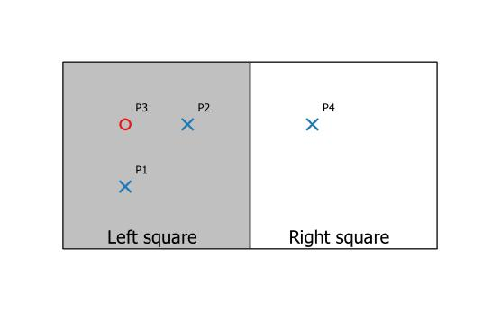
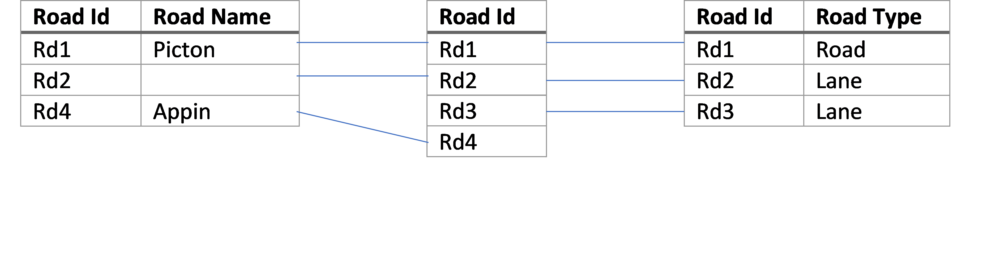
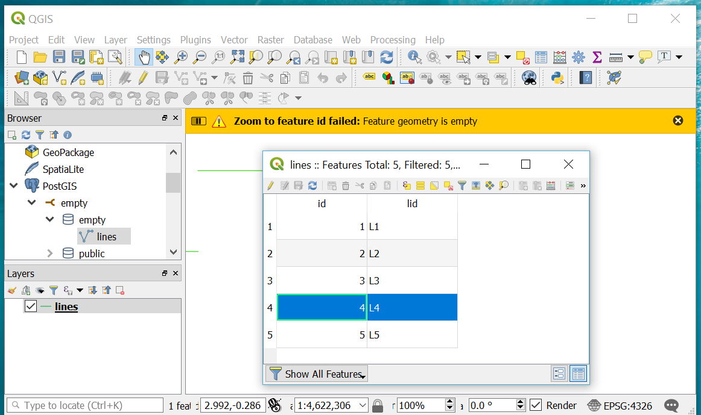
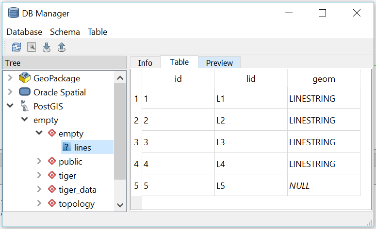
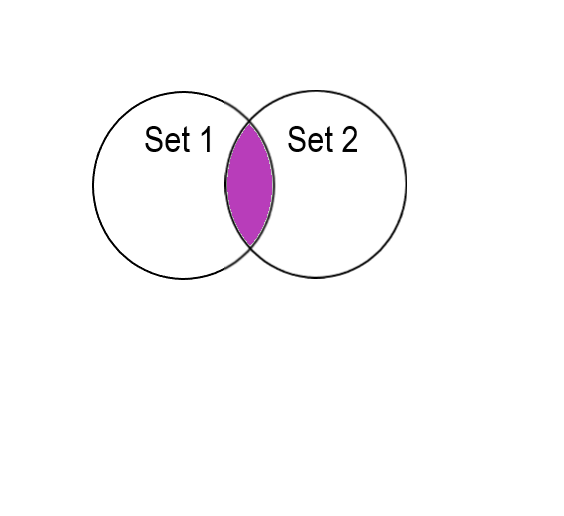
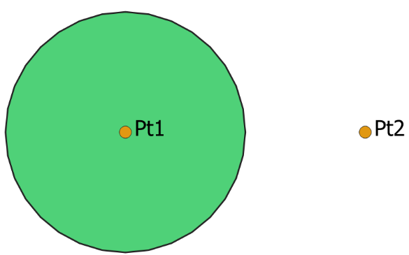

.. _concept-page:

###########################################################
A QGIS attribute table plugin to show empty and null shapes
###########################################################

**DRAFT**

************
Introduction
************
A dataset is a collection of records, where each record has a defined number of elements and the data type of each
element is also defined.  The elements are commonly referred to as attributes.  For example, a dataset of street names
may consist of records have the attribute heading *“Name”* of type variable character and the character heading
*“Street Type”* of type street type.  In this example, street types may consist of the values
*(‘Lane’, ‘Road’, ‘Street’, ‘’)*.  The first three of the values *‘Lane’*, *‘Road’* and *‘Street’* are obvious – but what about
the last value of *‘’*?  **‘’ is a deliberate empty set of character values!**  In our world there are many streets that
have no type, and, indeed there are many that have no name.  Here, the use of an empty set of characters, or ‘’,
indicates that the Street Type attribute has no type, not that the type is unknown (null).

Geospatial datasets contain one or more values that refer to a location on earth.  For the majority of geospatial
datasets, the location consists of one or more points, lines and/or polygons that are referenced to a coordinate system
that is a projection of the earth’s surface.

For the purposes of this project, any dataset element type that stores the geospatial shape with respect to a referenced
coordinate system is referred to as a geometry.  Any empty geometry element is simply a geometry that doesn’t
have a shape.

QGIS :cite:`QGIS` is a computer program that among other things is used to view,
create and edit the geometry elements within geospatial datasets.   QGIS does not: Pass null and empty geometry elements
equivalently for different data storage formats; does not show directly show which records within a dataset have null
or empty geometry elements; and, does not always process null and empty geometry elements as specified by standards.

This project aims to create a QGIS plugin that illuminates null and empty geometry elements in geospatial datasets.

**********
Background
**********
======================
Vector Datasets in GIS
======================
GIS refers to all of the components that are required to construct a Geographic Information System.  Every GIS system
needs components to store and retrieve spatial information and components to view and edit spatial information.

Spatial information is normally classified by whether it is a set of shapes referred to as a vector dataset or a
rectangular grid of values referred to as a raster dataset.  Here we are only concerned with vector datasets.

To facilitate storage and retrieval, an individual vector dataset is restricted to shapes and their attributes for a
specific subject.  To achieve utility, it is essential that the data type and range of valid values for each attribute
is defined.  The prescription of data types and value ranges is referred to as schema.   For example, many GIS systems
impose that a vector dataset may only contain one type of shape (e.g. point, line or polygon) and one shape object per
record.  A dataset that has a defined schema is by definition a database.

In many organisations, the geospatial vector datasets are located within enterprise databases that have one or more
data types that are specific to storing geospatial shapes.  An enterprise database refers to any database where
multiple users may query or edit the same dataset at the same time.  Consequently, the set of shape values available
needs to be consistent with the database design, and, these often include null and empty values.

=======================================
Null Values, Empty Values and Databases
=======================================
Datasets store values, and, sometimes these values are unknown.  The generic term for an unknown value is *null*.
Whether a dataset allows *null* values or not directly affects the type of logic used on the dataset.
The logic complication introduced by using null values is demonstrated by the example road name dataset shown
in :numref:`tableI`.  In :numref:`tableI` the roads ‘Rd1’ and ‘Rd4’ have the names ‘Picton’ and ‘Appin’ respectively.  The
road ‘Rd2’ doesn’t have a name which is typical of minor roads.  The name of ‘Rd3’ is unknown.

.. _tableI:

.. table:: Road name dataset example
   :widths: auto

   ======= ========= =========
   Road Id	Road Name Road Type
   ======= ========= =========
   Rd1     Picton    Road
   Rd2     Lane
   Rd3     *null*    Lane
   Rd4     Appin     *null*
   ======= ========= =========

======= ========= ========= =============
Road Id	Road Name Road Type	Line
======= ========= ========= =============
Rd1     Picton    Road      *null*
Rd2     Lane                {(2,0),(2,2)}
Rd3     *null*    Lane      {(1,1),(1,3)}
Rd4     Appin     *null*    {(0,2),(3,2)}
======= ========= ========= =============

The answer to the question “Does the road have a name?” is shown in :numref:`tableII`.  As already described, roads
‘Rd1’ and ‘Rd4’ do have names, road ‘Rd2’ does not have a name and it is unknown whether road ‘Rd3’ has a name or not.

.. _tableII:

.. table:: Does the road have a name query of :numref:`tableI`.
   :widths: auto

   +---------+-----------+---------------------------+
   | Road Id | Road Name |Has a road name?           |
   +---------+-----------+---------------+-----------+
   |         |           | (simple text) | (boolean) |
   +=========+===========+===============+===========+
   | Rd1     | Picton    | Yes           | True      |
   +---------+-----------+---------------+-----------+
   | Rd2     |           | No            | False     |
   +---------+-----------+---------------+-----------+
   | Rd3     | *null*    | Unknown       | *null*    |
   +---------+-----------+---------------+-----------+
   | Rd4     | Appin     | Yes           | True      |
   +---------+-----------+---------------+-----------+

Boolean logic, also referred to as two value logic allows only for True or False.  Boolean logic has no value when the answer is unknown.  When null values are permitted, three value logic is required whenever one of the answers is unknown.  Although beyond the scope of this project, it is noted that although Boolean logic is applied the same in the majority of relational databases there is known diversity in the application for three value logic.
In the described road name example, it was noted that the road ‘Rd2’ has no name.  If the ‘Road Name’ attribute is
considered to be a set of characters, then, the set of characters for Rd2’s ‘Road Name’ is empty.  By definition, an
empty set is a set that has no members.  By deduction, an empty set or an empty value is not a *null* value.  Hence, it
is **known** that road ‘Rd2’ does not have a name, but, it is **unknown** whether road ‘Rd3’ has a name or not.

:numref:`figureI` illuminates the application of empty values to geometry data types.  :numref:`figureI` shows the location of two
different point types (blue crosses and red circles) with respect to two squares referred to as “Left square” and
“Right square”.  Note that each point type consists of a set of points that may contain multiple points.  In reality,
the blue crosses may represent catholic churches, the red circles protestant churches and the squares may represent
suburbs.  :numref:`tableIII` shows the sets of individual points when categorized by Point type and Square.  The Left square
contains the set of Blue Crosses ‘P1’ and ‘P2’, plus the set of Red Circles containing ‘P3’.  The Right square contains
the set of Blue Crosses ‘P4’ and the empty set of Red circles.  An empty set of Red circles shows that it is known that
there are no Red circles in the Right square.

.. _figureI:

   The location of blue crosses and red circles in the “Left Square” and the “Right Square”.

.. _tableIII:

.. table:: A table showing individual points organised by Point type and Square.
   :widths: auto

   +--------------+----------------------------+
   | Point type   | Square                     |
   +--------------+-------------+--------------+
   |              | Left square | Right square |
   +==============+=============+==============+
   | Blue crosses | P1, P2      | P4           |
   +--------------+-------------+--------------+
   + Red circles  | P3          |              |
   +--------------+-------------+--------------+

By way of definition, an empty geometry is a geometry data type that has no members :cite:`OGC2010`.  The empty geometry
value is a placeholder that illuminates that it is known that no geometry exists.  An empty geometry is a known value,
whereas a null geometry is an unknown value that may or may not be empty.

Introducing an additional point type (e.g. Green stars) to :numref:`figureI` consisting of a set of null points greatly
complicates a relationship table like :numref:`tableIII`.  A null point exists whenever it is known that a point exists, but,
the location of the point is unknown.  Similarly, a null geometry exists whenever it is known that the geometry exists,
but, the actual geometry is unknown.  There is much variation with the logic applied to selecting and processing null
geometry values in different GIS systems, except when essential, these variations will not be explored here .

-------------------------
Set theory and empty sets
-------------------------
A set is a collection of objects, referred to as elements of the set.  An empty set is a set that has no elements, and,
is designated by :math:`\{\ \}`.
One way of representing a geometry is by text representation of vertices.  For example, the point geometry A with a
point located at the vertex :math:`(1,1)` is a one element set :math:`\{(1,1)\}`, whilst, the multiple point geometry B with points
located at the :math:`(1,1)` and :math:`(2,2)` is a two element set :math:`\{(1,1),(2,2)\}`.  The intersection of geometry A and geometry B is
also the one element set :math:`\{(1,1)\}`.  Hence:

.. math::

   geometry\ A\ ∩\ geometry\ B= point\{(1,1)\}\ ∩\ point \{ (1,1),(2,2)\}= point \{(1,1)\}

Similarly, consider the intersection of squares with the vertices :math:`\{(0,0),(0,2),(2,2),(2,0),(0,0)\}` and
:math:`\{(1,1),(1,3),(3,3),(3,1),(1,1)\}`.

.. math::
   square\{(0,0),(0,2),(2,2),(2,0),(0,0)\}∩square\{(1,1),(1,3),(3,3),(3,1),(1,1)\}=square\{(1,1),(1,2),(2,2),(2,1),(1,1)\}

Now, consider the intersection of the squares with the vertices :math:`\{(0,0),(0,2),(2,2),(2,0),(0,0)\}` and
:math:`\{(3,0),(5,0),(5,2),(3,2),(3,0)\}`:

.. math::
   square\{(0,0),(0,2),(2,2),(2,0),(0,0)\}∩square\{(3,0),(5,0),(5,2),(3,2),(3,0)\}=square\{\ \}

These squares are disjoint as they have no area in common.  Their intersection produces an empty set of vertices.

***NEED TO ADD FIGURES***

---------------------------------------------
Empty and null shape values are not universal
---------------------------------------------
There are many organisations that have geospatial datasets that have schema that prohibit null and empty shape values.
Null values are most commonly avoided by using a lookup table that contains only those values that are known.  For
example, the same road dataset presented in :numref:`tableI` can also be described with two look up tables for Road
Name and Road Type that no longer contain null values as shown in :numref:`figureII`.  Both :numref:`tableI` and
:numref:`figureII` are equivalent.  Using the same approach, lookup tables can be used to store geometry data
values.  By design, a geometry lookup table does not contain a record when a geometry value is unknown (null).   Using
the lookup table approach, those records that are missing geometry data sets are identified by constructing an
appropriate join to the geometry containing lookup table.

.. _figureII:

   Road name dataset example using lookup tables to avoid null values.

The use of a lookup table to contain geometry datasets in comparison to storing the geometry datasets in a single table with other relevant attributes requires an additional table to be created and a lookup key to be maintained.  A major advantage of the lookup table approach is that one can maintain the main non-geometry dataset in one enterprise database system that is not geospatially enabled, and, the ancillary geometry dataset in a geospatially enabled database.  Another advantage is that an organisation can use a single piece of geospatial software to maintain the geometry data that is associated with data in several different enterprise databases.  In this way, geospatial capability can be retrofitted to an enterprise database.  A major disadvantage of the lookup table approach is the requirement for the documentation of database schema for users to maintain the lookup key and to perform database queries that include spatial and non-spatial attributes.

Empty values and their use are much more complicated to resolve relative to null values.  Prohibiting empty values has
two major software design ramifications: Datasets are unable to contain multiple shape attributes; and, false set operations have to be removed by a selection.

^^^^^^^^^^^^^^^^^^^^^^^^^^^^^^^^^^^^^^^^^
Records with multiple geometry attributes
^^^^^^^^^^^^^^^^^^^^^^^^^^^^^^^^^^^^^^^^^
Much of the GIS community work with the schema  restriction of a single geometry attribute data set.  It is difficult
to have multiple geometry attributes without also allowing empty geometry attributes.  Next, I will examine the
advantages and disadvantages of multiple geometry attributes.

The fundamental advantage of multiple geometry attributes is they facilitate topology. Topology refers to how the
constituent parts of a system are interrelated or arranged.  The location of points within squares shown schematically
in :numref:`figureI` is an example of topology as it shows how the points are related to squares.  :numref:`tableIII` shows the topological
association of point type by square type, but, uses two geometry columns to do so.  :numref:`tableV` shows the same data as
:numref:`tableIII` using only one geometry column.  Examination of :numref:`tableV` reveals that the relationship between a type of point (e.g. Blue Crosses) and the Square type (e.g. Left Square or Right Square) has to be reported as two separate
relationships (two separate records) and a user is left with the task of mentally connecting these two relationships.  Clearly, without using multiple geometry columns showing topological relationships is less intuitive.

.. _tableV:

.. table:: Another way to represent the data in :numref:`tableIII` that uses only one geometry column.
   :widths: auto

   +--------------+----------------------------------+
   | Square       | Point type                       |
   +==============+==================================+
   | Left square  | Blue crosses :math:`\{P1,\ P2\}` |
   +--------------+----------------------------------+
   + Left square  | Red circles :math:`\{P3\}`       |
   +--------------+----------------------------------+
   | Right square | Blue crosses :math:`\{P4\}`      |
   +--------------+----------------------------------+
   + Red circles  | red circles :math:`\{empty\}`    |
   +--------------+----------------------------------+

The major disadvantage of multiple geometry columns is that they are not supported by many pieces of GIS software or GIS file formats.  For example, ArcGIS does not support multiple geometry columns in any capacity, QGIS treats each geometry column as an unrelated dataset, and, the ubiquitous shapefile can only contain one geometry column.  So, by adopting multiple geometry columns you are isolating yourself from a large portion of the GIS community.

^^^^^^^^^^^^^^^^^^^^^^^^^^^^^^^^
Records with false Boolean logic
^^^^^^^^^^^^^^^^^^^^^^^^^^^^^^^^
Many GIS software packages force the user to perform a selection whenever they perform a set operation like a union,
intersection or difference.  The results of an intersection without a selection of the points and squares shown in
:numref:`figureI` includes those records that don’t intersect (:numref:`tableV`).  To achieve the more common output shown in
:numref:`tableVI` a selection must be performed on the data to include only those records that do intersect.  Hence, the logic
performed by most GIS software packages including ArcGIS and QGIS is: 1. Select those records where intersect is True; 2. Perform intersection.

.. _tableVI:

.. table:: Another way to represent the data in 5 where records where no intersection occurs are also shown.
   :widths: auto

   +--------------+----------------------------------+
   | Square       | Point type                       |
   +==============+==================================+
   | Left square  | Blue crosses :math:`\{P1,\ P2\}` |
   +--------------+----------------------------------+
   + Left square  | Red circles :math:`\{P3\}`       |
   +--------------+----------------------------------+
   | Right square | Blue crosses :math:`\{P4\}`      |
   +--------------+----------------------------------+

Being forced to do a selection in addition to an intersection is an algorithmic solution that eliminates the need for empty geometry values.  Forcing a selection as part of a set operation introduces the assumption that records missing from the results are empty (e.g. do not intersect) and hence prohibits the ability to also record unknown (*null*) set operations.  Another problem of forced selection is that problem solving of erroneous set operations is hindered as one needs to undertake additional steps to confirm those records that were explicitly excluded by the forced selection.  For logic and critical thinking analysing the negative results can be more fruitful than analysing the positive results!

====
QGIS
====
QGIS is self-promoted as an “Open Source Geographic Information System” :cite:`QGIS`.  QGIS is used for creating, manipulating and publishing spatial data sets by many organisations.  Some organisations use QGIS to edit or create geometries for geospatial datasets within enterprise databases in their native format as no commercial software has this capability.  For example, `SMEC Pavement Management Software <http://www.smec.com/en_au/what-we-do/sectors/transport/pavement-management-systems>`_ uses a Microsoft SQL database to contain it’s pavement datasets.  QGIS can browse and edit the geometries contained within this dataset without importing or exporting any dataset.   In comparison, software like ArcMap requires a user to import, edit, then export the data to the SMEC Pavement Management Software even though both installation could have their data respective datasets within the same Microsoft SQL Server installation, and, both datasets are using the same datatype for the geometry values.
By intentional design and function, the majority of QGIS users use other software packages or software formats developed by other organisations to store geospatial datasets.  For example, the PostGIS, MS SQL and SpatiaLite databases, and, the esri shapefile format are all processed in their native format by QGIS.

------------
QGIS history
------------
QGIS was created by Gary Sherman in 2002 :cite:`QgisContributors,GarySherman2011`.  In 2007 it became a project of the Open Source Geospatial Foundation with version 1 being released in January 2009 :cite:`QgisContributors`.  The version of QGIS used in this project, Version 3, was released in February 2018 :cite:`QgisContributors`.  Version 2 of QGIS employed Python 2 for scripting and PyQT4 for the graphical user interface (GUI).  Version 3 of QGIS employs Python 3 for scripting and PyQT5 for the GUI.  QGIS version 3 is self-described as a “huge overhaul and cleanup” of QGIS version 2 :cite:`QgisChangelogV3`.  Many of the python scripts configured for version 2 no longer work with version 3 with much of the legacy sub-version support dropped.

---------------------------
Vector datasets within QGIS
---------------------------
Within QGIS, the geometries for each record are contained within instances of QgsAbstractGeometry subclasses :cite:`QGSGeometryClass`.  The manner in which QGIS stores empty geometries is not inherited from the QgsAbstractGeometry superclass, but rather is determined for each subclass separately.  Although QGIS is capable to parse empty geometries for the majority of the QgsAbstractGeometry subclass there may be some that are unable to do so.

The variations in how QgsAbstractGeometry subclasses contain empty geometries is demonstrated in the following section by example.  Using the QGIS API, empty geometries for several geometry types can be instantiated by instantiating the relevant QgsAbstractGeometry subclass without a set of vertices.  For example, to test that a ``QgsLineString()`` is empty:

.. doctest::

   >>> from qgis.core import QgsLineString
   >>> QgsLineString().isEmpty()
   True

Although empty geometries can be created for most geometry types with the QGIS API by instantiation without a set of vertices, it is not currently possible to instantiate an empty point geometry (:numref:`tableVII`). As demonstated below, the well known text representation of the call to instantiate an empty point reveals that QGIS is wrongly adding a vertex with the coordinates of :math:`(0\ 0)` :cite:`QgsPointBugReport2018` [#f1]_.

.. doctest::

   >>> from qgis.core import QgsLineString,QgsPoint
   >>> print(QgsLineString().asWkt())
   LineString ()
   >>> print(QgsPoint().asWkt())
   Point (0 0)
   >>> print(QgsPoint().createEmptyWithSameType().asWkt())
   Point (nan nan)

.. _tableVII:

.. table:: Testing whether an empty geometry has been created by the instantiation of various types of QgsAbstractGeometry subclasses using the python Console in QGIS 3.0.3.
   :widths: auto

   +---------------------------------------+-----------+
   | Input                                 | Output    |
   +=======================================+===========+
   | ``QgsPoint().isEmpty()``              | ``False`` |
   +---------------------------------------+-----------+
   | ``QgsLineString().isEmpty()``         | ``True``  |
   +---------------------------------------+-----------+
   | ``QgsPolygon().isEmpty()``            | ``True``  |
   +---------------------------------------+-----------+
   | ``QgsGeometryCollection().isEmpty()`` | ``True``  |
   +---------------------------------------+-----------+

******************
PROBLEM DEFINITION
******************
The problems that this project intends to address are:

1.	Null and empty shapes are parsed differently by different data providers in QGIS.
2.	Within QGIS, there is no published plugin or output that shows records within a dataset that have null or empty geometry values.
3.	Many GIS professionals do not anticipate or are aware of datasets that have null or empty geometries.
4.	Empty geometry values were not included in the set of valid values in the original QGIS or GDAL specifications.

=======================================================================
PARSING OF NULL AND EMPTY SHAPES TO AND FROM EXTERNAL DATABASES BY QGIS
=======================================================================
Using source specific data providers, QGIS processes data to and from third party databases without requiring constraints or additional tables in the third-party database.  Each data provider has been created independently and these do treat the same data values differently.  For example, as expected QGIS parses empty linestrings from PostGis databases as not null but it incorrectly parses empty linestrings from Microsoft SQL Server as null :cite:`ParseEmptyFromSql`.

-------------------
QGIS Data Providers
-------------------
A component of software that allows it to directly read data without conversion to a different data type, and, to write updates or new records to a dataset without exporting is called a data provider.   QGIS contains data providers for 18 different formats for which it can read from or write to in their native format :cite:`QGSProviders2018`.  Being open source, each of the data QGIS providers were created at different times for different purposes, are founded on different philosophies and have different levels of development.  Consequently, even when different database packages follow the same geospatial standards, equivalent shapes from those different database packages may be read as different shapes due to variations or errors between data providers.

Within this project it is anticipated that errors passing empty or null values from Microsoft SQL Server or PostGIS will be found.  Unfortunately, the C++ classes employed in the data type specific data providers :cite:`QGSProviders2018` are not exposed in the QGIS API which means that their function is not easily modified.

QGIS’s data providers that allow it to read or write in native format without need for additional constraints or data tables is a key feature that makes it popular in large organisations. By reading and writing in the native format, QGIS can edit or create geospatial data within an enterprise database that is configured for another piece of software and without importing and exporting.  In doing so QGIS has removed one of the barriers to integration of geospatial data within enterprise datasets.

In comparison to QGIS’s approach of editing the data in it’s native format, ESRI’s ArcMap requires a user to import into a geodatabase and undertake the editing there– even though the enterprise database and the geodatabase may be using the same database server :cite:`ArcGISTutorialForEmpty`.  ESRI’s approach often leads to a lookup table being used for geospatial data and then scripts run on those lookup tables to publish an integrated dataset.

===============================================
EXPOSURE OF NULL AND EMPTY SHAPE VALUES IN QGIS
===============================================
Within QGIS, without using custom expressions or scripts there is only limited exposure to null shapes, and, empty shapes.  Two locations within QGIS where you may find descriptive information of each record are the *“Attribute Table”* and the *“DB Manager”* plugin.

Without using expressions and creating new attributes, the “Attribute Table” does not contain any information about the record’s shapes.  The only component of the “Attribute Table” that exposes empty or null geometries is when a user selects “Zoom to Feature” for a specific record.  In QGIS version 3.x, a warning message is shown on the map canvas that the shape is empty or doesn’t exist depending on whether the shape is empty or *null* (:numref:`figureIII`).

.. _figureIII:

   A warning message is displayed in QGIS when a user attempts to zoom to a record with an empty geometry.

The DB Manager in QGIS 3.x is a core plugin (it can’t be uninstalled).  The DB Manager plugin provides database specific information for data from a limited number of databases that includes PostGIS, but, excludes Microsoft SQL Server.  The Table view within DB Manager shows all of the columns within the table including the geometry attribute.  For the geometry column it gives the geometry type and exposes null shapes as *“NULL”* (:numref:`figureIV`).

.. _figureIV:

   The output from the DB Manager plugin in QGIS 3.x for a dataset that contains both empty geometry values and null geometry values.

==========================
GIS PROFESSIONAL AWARENESS
==========================
Many GIS professionals are educated and work within GIS dataset schema where both null and empty geometries are excluded.  It is plausible that GIS professionals that are not familiar with null and empty shapes are ignorant of them when using a GIS where they are permitted.  This is a situation that confronted the proponent of this project.  Examples of wrong understanding of null and empty geometry values are widespread on the world wide web.  For example, an article published by esri incorrectly states that an empty geometry exists for any geometry where the coordinates are unknown :cite:`ESRINullOracle`.

Micosoft SQL and PostGis both permit null and empty geometry values unless explicitly excluded by constraints or third party software.  Even when a primary dataset contains no null or empty geometry values, processing of that dataset may produce empty null or empty geometry values.  Performing set operations like intersections within the database, and, editing geometry of specific records within QGIS are two ways empty geometry values can be created.

----------------------------------------------------------------------------
Set operations in Microsoft SQL or PostGIS can produce empty geometry values
----------------------------------------------------------------------------
There are several fundamental set operations that are used to construct new sets from existing sets regardless to what it is a set of :cite:`SetTheoryOverall`.  Within a database, a set operation needs to be consistent for all data types.  As introduced in section :ref:`Records with false Boolean logic` some databases generate empty geometry values for set operations.  Microsoft SQL Server and PostGis are examples of databases that can generate empty geometry values for set operations.  Both of these databases developed from SQL conventions and their generation of empty values for geometries is consistent with set operations for other data types.

Intersection of two sets is an example of a set operation.  Intersect refers to those locations where two or more objects meet, cross or cover each other :cite:`IntersectDefinition`.  Many different fields that employ set theory, Intersect of two datasets returns all records that exist in both datasets (:numref:`figureV`).  The intersect concept can be applied to many datatypes including characters, numbers, dates, and, geometries.

.. _figureV:

   The schematic intersection of Set 1 and Set 2 is purple.

Consider the intersection of the points ‘Pt1’ and ‘Pt2’ with the circle shown in :numref:`figureVI` which is an example of an intersection between two geometry datasets.  ‘Pt 1’ lies within the circle, and, hence intersects the circle.  ‘Pt2’ lies outside the circle and does not.  In both QGIS v3.x and ArcGIS desktop, the intersection of a points dataset containing ‘Pt1’ and ‘Pt2’ and a dataset containing the circle will return only those records that intersect, hence, only ‘Pt1’ is returned.  In contrast, in Microsoft SQL Server, the intersection returns both the records that do and don’t intersect with a dataset containing both ‘Pt1’ and ‘Pt2’.

.. _figureVI:

   A schematic of the intersection of points ‘Pt1’ and ‘Pt2’ with a circle.

There is no error with either the approach to intersection taken by QGIS 3.x and Microsoft SQL Server.  As described in the section :ref:`Records with false Boolean logic` QGIS 3.x includes an addition selection logic step that removes those records that don’t intersect.  For ‘Pt2’, Microsoft SQL server is returning an empty geometry confirming that no intersection exists, as shown by the following Transact-SQL script [#f2]_::

   DECLARE @circle geometry = 'CURVEPOLYGON (CIRCULARSTRING (0 1, 1 2, 2 1, 1 0, 0 1))';
   DECLARE @Pt2 geometry = 'POINT (3 1)';
   SELECT @Pt2.STIntersection(@circle).ToString();
   GEOMETRYCOLLECTION EMPTY

This intersection example shows the ease with which one can inadvertently generate empty geometry values in Microsoft SQL Server, and, these empty geometry values will be passed to QGIS.

---------------------------------------------------
Inadvertently Creating Empty Geometries within QGIS
---------------------------------------------------
Within QGIS, an empty geometry is created by using the “Vertex Tool” to delete all vertices of an existing shape.  A user unfamiliar with QGIS may incorrectly assume that deleting all the vertices of a shape also deletes the record.  Hence, when editing a shape, a QGIS user may unintentionally create an empty shape when they are attempting to delete the shape.

==================================================================
Retrospective incorporation of empty and null values into Software
==================================================================
The Geospatial Data Abstraction Library (GDAL) is ubiquitous within most GIS Software to translate and process geospatial data.  Handles for empty shapes were not part of the original GDAL specification, with empty shapes being treated as null.   The retrospective incorporation of empty handles into GDAL has not been picked up by many applications that employ GDAL, and, even within GDAL there are many processing tools that do not allow for empty shapes.

Many of the current GDAL set operators continue to convert empty geometry values to null geometry values even when the set being operated on has successfully implemented the empty shape handle on passing to GDAL.  For example, for the Intersection operation the output is *“a new geometry representing the intersection or NULL if there is no intersection or an error occurs”* :cite:`GDALIntersection`.  Curiously, the same GDAL geometry class has a handle to assign an empty geometry, or, to test for an empty geometry :cite:`GDALEmpty`.  On another GDAL ticket register it is stated *“GML/WFS: by default does not advertise NOT NULL fields since we treat empty strings as being null for historical reasons. By setting the open option EMPTY_AS_NULL=NO, empty strings will be reported as such and NOT NULL fields might be advertised”* :cite:`Rouault2015`, it is clear that GDAL is not originally intended to distinguish between null and empty.

The retrospective addition of handles for empty geometry values in GDAL was mimicked by QGIS.  Consequently, within QGIS there are likely to many set operators that convert empty values to null values as part of the set operation.

----------------------------------------------------------
The definition of Null and Empty Values depends on context
----------------------------------------------------------
The definition of Empty geometry values introduced in section 2.2 it was articulated that an Empty geometry is just one valid value in the set of valid values for the geometry data type.  In contrast, null indicates that the geometry value is unknown and that the value can be any value from the set of valid values. Hence, an empty geometry values is one of many possible values for a null geometry (or, empty is a subclass of null).  For example, for a point, the vertices of an empty point are :math:`\{\ \ \}` as it has no coordinates, and, the vertices of a null point are :math:`\{x,y\}` where :math:`x` and :math:`y` are both variables designating unknown coordinates. These definitions are consistent with SQL relational databases.  Unfortunately, the definition of null used by SQL relational databases is different to that used by both mathematics for set theory, and, but most computer programming languages :cite:`WhatIsNull`.

Let’s consider the definition of null for set theory and computer programming using a common example.  If one has a box of apples and a box of bananas, then the intersection of the two boxes of fruit is an empty box. For set theory, *null* – nothing is what you have when you take away the box.

Similar to set theory, for most object-oriented computer programming languages, an object that has not been instantiated is *null*.  Hence, a pointer to something that doesn’t exist is null. An empty object is an object that has been instantiated but not populated, for example, a list with no members, or, a box with no fruit.

So, from the perspective of an object-oriented computer programming language, null means no value.  Hence, a null object is an object that does not exist, or, occupies no space in a computer’s memory.  Indeed, SQL relational databases implement null as an object that doesn’t exist, so, the context difference between unknown and nothing does not have to create conflict.

The underlying conflict is based on logical deduction.  It has been proved that an empty set is a subset of any set.  It is argued that on object that doesn’t exist can’t contain anything, so, it must be empty [#f3]_.  Hence, *null* is a subclass of empty.  However, an empty set is a still a set, a container that is empty.  In contrast, null states that no container exists.  So, by arguing that a *null* object is empty you have just created an object.  A *null* object neither contains anything nor has a container.

Unfortunately, QGIS employs the logic that a null geometry is also an empty geometry :cite:`QGSGeometrySource2018`.    The QGIS test for null simply asks where there the object point points to anything :cite:`QGSGeometrySource2018`::

  144 bool QgsGeometry::isNull() const
  145 {
  146  return !d->geometry;
  147 }

Now, the QGIS test for empty performs the same test as for null, and, returns true if the test for null returns true :cite:`QGSGeometrySource2018`::

  329 bool QgsGeometry::isEmpty() const
  330 {
  331  if ( !d->geometry )
  332  {
  333  return true;
  334  }
  335
  336  return d->geometry->isEmpty();
  337 }

.. [#f1] a ``Point (nan nan)`` is also reported when an empty PostGis point is parsed by QGIS.

.. [#f2] In both Microsoft SQL and PostGis the geometry type that is empty is recorded :cite:`Loskot2010,Ramsey2010`).  Sometimes the geometry type gets changed to the generic ‘GEOMETRYCOLLECTION’ by set operations.

.. [#f3] Unable to find a high quality reference for this argument.  Several private conversations with C++ programers reveal that this logic is common and is frequently used to test for empty in C++.

************
Bibliography
************

.. bibliography:: NullFeaturesInQGIS.bib
   :style: plain

