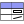

|att_table|

============================================================
GeomAttribute: A QGIS Attribute Table with a Geometry Column
============================================================

A QGIS 3 plugin that shows an attribute table which includes a geometry column for any vector layer.

This plugin has the following tools:

.. toctree::
   :maxdepth: 2
   :caption: Contents:

   geomAttribute
   loadData
   about
   API
   concept
   changelog

==================
Indices and tables
==================

* :ref:`genindex`
* :ref:`modindex`
* :ref:`search`
