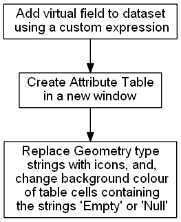

*************
Plugin Design
*************

A QGIS plugin was created that generates an attribute table with a geometry describing column for the active vector layer in a QGIS workspace.  The created geometry describing column is a mixture of two data types combining both geometry data values and geometry data types.  Icons are used for geometry data types to create an intuitive language independent graphical interface.

The plugin is constructed with Python script using Python 3.x.  By intention, current QGIS classes and methods are used as much as possible to reduce script complexity and to be resilient to new versions of QGIS.  Initially the plugin was created with the QGIS plugin Builder Tool :cite:`PBTool`.

The main conceptual processes of the plugin are shown in :numref:`figurePluginDesign` and are described in the following sections.

.. _figurePluginDesign:

   The key processes in the *Geometry Attribute Table* plugin.

==============================
Geometry Describing Expression
==============================

The geometry describing expression can be accessed by the :ref:`parseQGISGeometry-API` in the API, and, is shown below:

.. literalinclude:: ../../parseQGISGeometry.py
   :pyobject: geometryField

This expression is performed per individual record (feature).  This expression has a string data type output.  A few characteristics of this expression are:

   1. it needs to test for *null* geometry values before *empty* geometry values;
   2. it has specific tests for *empty* point geometry values as these are given the set of vertices *{0 0}* or *{nan nan}* by QGIS depending on how they are instantiated;
   3. It reports the feature's geometry data value when the geometry is *empty* or *null*, otherwise, it reports the feature's geometry type; and,
   4. in the output, geometries with elevation (z values) or with measurements (m values) will still be distinguished from those without either.

This expression is used to populate a virtual field called *"Geometry"* that is appended to a vector dataset.  A virtual field is a computed field that exists in memory only and is not written to the datasource.  As the virtual field is appended to the vector layer, it may be viewed or used wherever a virtual field is present in QGIS.  For example, when the window created by the plugin is open, the created *"Geometry"* field is included as a column in the standard *Attribute Table*.

========================
Attribute Table Creation
========================

The attribute table shown by the plugin is created by a process that is analogous to the standard QGIS Attribute Table.  Basically, a cache of the dataset is made, and a model of the dataset is constructed so that Qt's model-view :cite:`QtModelView` approach can be applied.  When a piece of software outputs a table display of a data source, the software needs to replicate each data item and keep a synchronization between the original and the replication.  Qt's model-view reduces both the replicated dataset's size and reduces the computing resources required for synchronization between the primary and replicated datasets.  The following script is contained within the ``run(self)`` method that is within the ``geomAttribute`` class in the ``geomAttributeRun`` module of this plugin:

.. code-block:: python

   #   Create a cache of the vector layer data of size 10000
   #   Cache geometry is true by default
   #   For example: print(self.vector_layer_cache.cacheGeometry())
   self.vector_layer_cache = QgsVectorLayerCache(self.layer, 10000)

   #   QgsAttributeTableModel is a subclass of QAbstractTableModel
   self.attribute_table_model = QgsAttributeTableModel(self.vector_layer_cache)

Within the same ``run(self)`` method of the ``geomAttribute`` class a filter is applied to the model of the dataset to cater for situations where selections are made:

.. code-block:: python

   #   The QgsAttributeTableFilterModel() is used to synchronize any selection.
   self.attribute_table_filter_model = QgsAttributeTableFilterModel(
   self.iface.mapCanvas(), self.attribute_table_model)

======================================
Putting Icons into the Attribute Table
======================================

Qt's item delegate function is used to replace the string field in the virtual *"Geometry"* column in the plugin's Attribute Table.  This delegate function does not affect the same virtual field where it is used outside of the plugin's Attribute Table.  For example, the output of the same virtual field in the standard QGIS Attribute Table remains a string.  Icon's only replace strings for geometry types that *contain* the strings listed in :numref:`tableDelegateType` which are contained within a Python dictionary in the script. Any geometry type that doesn't contain a string shown in :numref:`tableDelegateType` will remain as a string.  For example, a string value of *CircularString*, *CompoundCurve* or *GeometryCollection* will remain unchanged and not be replaced by an icon.  As the script searches for strings that *contain* the string: the string-switched-icon represents all variations of a geometry subtype including those that contain elevations or measurements; and, the order of searching and hence the order of dictionary keys is essential.  For example, a search for *Point* would return *True* for *MultiPoint* as the string *Point* is contained within *MultiPoint*.  So, *MultiPoint* needs to be searched for prior to *Point*.

Strings instead of icons are only used for *empty* and *null* geometry values with the application of background colors for several reasons.

For *empty*, there are several notations to represent an *empty* set including :math:`\{\ \}` and :math:`\varnothing`.  Neither of these notations for *empty* sets are widely known outside of mathematics and many QGIS users may not understand them without investigating.  To aid interpretation, the string *empty* is kept in the Attribute Table with a background color of dark yellow.  The use of tooltips for *empty* geometry data values is one possible approach in the future to use the empty set notation of :math:`\varnothing` instead of the string *empty*.

One possible symbol for *null* is :math:`x` which normally refers to an unknown variable, but, *null* refers to an unknown set of variables, not a single variable.  Imieliński and Lipski proposed the use of *"@"* for *null* :cite:`Imielinski1984`, however, this was not adopted by other researchers.  As there is no universal symbol for *null*, the string *null* was used in combination with a background color of red.

.. tabularcolumns:: |c|l|

.. _tableDelegateType:

.. table:: The strings that are replaced with icons by the item delegate function.
   :widths: auto
   :align: center

   +------------+---------------+
   | Precedence | Geometry Type |
   +============+===============+
   | 1          | MultiPoint    |
   +------------+---------------+
   | 2          | Point         |
   +------------+---------------+
   | 3          | MultiLine     |
   +------------+---------------+
   | 4          | Line          |
   +------------+---------------+
   | 5          | MultiPolygon  |
   +------------+---------------+
   | 6          | Polygon       |
   +------------+---------------+

The Python script that exchanges geometry type strings with icons, and, changes the background color of *Empty* and *null* geometry value strings is contained within the ``paint`` method in the ``myDelegate`` class of the ``geomAttributeRun`` module, as shown below:

.. literalinclude:: ../../geomAttributeRun.py
   :pyobject: myDelegate.paint

=============
Plugin Window
=============

The attribute table produced by the plugin is contained within a Qt Window.  The preliminary plugin created by the QGIS *Plugin Builder* plugin instantiated a Qt Dialog.  This Qt Dialog was exchanged with a Qt Window during the development of this plugin so that a tool bar with a help icon could be added to the window containing the attribute table.  The Qt Window allows for further development of the plugin.

The plugin window is instantiated by the ``geomAttribute_window`` module:

.. literalinclude:: ../../geomAttribute_window.py
   :pyobject: geomAttributeWindow

The plugin window design is in Qt's designer file format (file extension .ui).  With this approach, the window design can be changed independently from the plugin's Python script using Qt Designer.  To function, the *"Table View"* widget in Qt Designer had to be subclassed with the QgsAttributeTableView.

As Qt's item delegate is used to replace strings in the produced attribute table with icons, all of the filenames for the icons had to be added to the Qt resource collection file (``resources.qrc``).  The resources used by Qt have to be compiled whenever changes are made to the resource collection file.

The instantiation of the *Geometry* virtual field is coupled to the plugin's window instantiation, such that this field is deleted when the plugin's window is closed.

=================
Plugin Help Files
=================

The initial intention was to contain all of the plugin's help files within the plugin so that they can be accessed offline.  However, the construction of help files using the Qt framework was cumbersome.  It was more efficient to produce HTML help files using `Sphinx <http://www.sphinx-doc.org/en/master/>`_ and have these hosted by the plugin's GitHub site.  An inspection of the `help files for QGIS <https://docs.qgis.org/testing/en/docs/user_manual/index.html>`_ and the help files of many QGIS plugins revealed that most QGIS plugin help files are hosted on the world wide web and require an internet connection to access.  Ironically, Sphinx can also produce *Qt Help* formatted files, and, this may be exploited in the future to generate offline help files.

==================
Future Development
==================

There is much scope to enhance the plugin.  Some priorities for improvement are:

   1. add a summary table that reviews large datasets for *null* or *empty* geometry values;
   2. add another virtual field that displays the number of parts for multipart geometries;
   3. add icons for geometries with curved segments; and,
   4. add support for geometries with measurements or elevation.