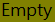

.. _geometryAttributeTable-page:

************************
Geometry Attribute Table
************************

|att_table| An attribute table window which includes a geometry describing column for any vector layer.

The geometry column uses the icons shown in :numref:`geometryIcon-table` to indicate a feature's geometry value or type in descending precedence: unknown (null); empty; point; multi-part point; line; multi-part line; polygon; and, multi-part polygon.

.. _geometryIcon-table:

.. list-table:: Icons used to represent various geometries.
   :widths: 10 18 13
   :header-rows: 1
   :align: center

   * - Icon
     - Geometry Description
     - Precedence
   * - |Null|
     - Unknown value
     - First
   * - |Empty|
     - Empty value
     - Second
   * - |poin_1x|
     - Point type
     - Third
   * - |poin_2x|
     - Multi-Part Point type
     - Fourth
   * - |line_1x|
     - Line type
     - Fifth
   * - |line_2x|
     - Multi-Part Line type
     - Sixth
   * - |poly_1x|
     - Polygon type
     - Seventh
   * - |poly_2x|
     - Multi-Part Polygon type
     - Eighth

.. |poin_1x|  image:: ../../../icons/point_1x.png
.. |poin_2x|  image:: ../../../icons/point_2x.png
.. |line_1x|  image:: ../../../icons/line_1x.png
.. |line_2x|  image:: ../../../icons/line_2x.png
.. |poly_1x| image:: ../../../icons/polygon_1x.png
.. |poly_2x| image:: ../../../icons/polygon_2x.png

The plugin does not distinguish between two dimensional and three dimensional shapes, nor between those with or without measurements.  The plugin does not consider whether geographic or cartesian coordinates are used for the spatial reference system.

===
Use
===
This tool works on the current active layer within QGIS.  The current layer needs to be a vector layer.  This tool will not work on a raster layer.

Within QGIS, click on the vector layer to be analysed in the *Layers Panel* to make it active, then click on the *Geometry Attribute Table* icon |att_table| or select the *Geometry Attribute Table* item from the *Geometry Attribute Table* group on the *Plugins* menu.  Successful use of the *Geometry Attribute Table* tool will display a new window with the title *"Geometry-Attribute Table"* that contains an attribute table where the last column has the heading *"Geometry"*.  :numref:`figureScreen` shows an example of an open *Geometry Attribute Table* output window with a *"Geometry"* column heading. This geometry describing column uses the icons shown in :numref:`geometryIcon-table` to represent each record's geometry.

.. _figureScreen:

.. figure:: ../_static/pluginScreenShot.png
   :scale: 70%
   :align: center

   A screen shot of the window containing an attribute table produced by the *Geometry Attribute Table* tool in a Microsoft Windows environment.

A text version of the *Geometry* column will also be appended to the conventional QGIS attribute table (:numref:`figureScreen2`).  Successful closing of the *Geometry Attribute Table* window will also remove this appended *Geometry* column.

.. _figureScreen2:

   A screen shot of the standard QGIS Attribute Table window showing the same dataset shown in :numref:`figureScreen` in a Microsoft Windows environment.  The column with the heading *"Geometry"* is a virtual field created by the *Geometry Attribute Table* tool and will be removed when the *Geometry-Attribute Table* window is closed.

.. |att_table|  image:: ../../../icons/attribute_table.png
   :scale: 50%

.. |space| unicode:: U+00A0