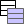

*********
Load Data
*********

The |model_data| *Load Data* function creates the following QGS memory vector layers:

   * Multi-part Lines
   * Multi-part Points

These layers are ideal to observe the utility of the :ref:`geometryAttributeTable-page`.

The methods that create these layers are contained within the :ref:`modelVectorLayers-API`.

